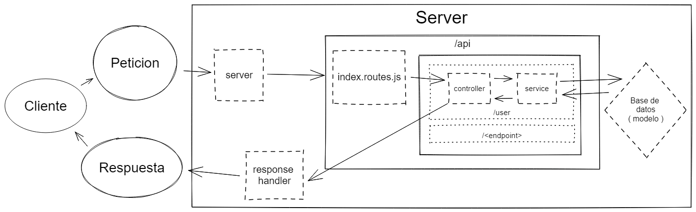

## Backend Template para proyecto ingeniería de software

### Instrucciones de instalacion

- Clonar el repositorio
- Instalar dependencias con `npm install`
- Crear archivo `.env` con las variables de entorno, en la carpeta `/config`
    - Sigue la estructura del archivo `.env.example`
    - Agrega la variable `PORT` con el puerto en el que quieres que corra el servidor
    - Agrega la variable `HOST` con la URL del servidor
    - Agrega la variable `DB_URL` con la URI de la base de datos
    - Agrega la variable `JWT_SECRET` con la llave secreta para el JWT
- Correr el servidor con `npm start`

### Estructura de carpetas

```bash

├── NombreProyecto
│   ├── node_modules
│   ├── src
│   │   ├── config
│   │   │   ├── .env
│   │   │   ├── configDB.js
│   │   │   └──configEnv.js
│   │   ├── controllers
│   │   │   └── user.controller.js
│   │   ├── models
│   │   │   └── usuario.model.js
│   │   ├── routes
│   │   │   └── user.route.js
│   │   │   └── index.routes.js
│   │   ├── services
│   │   │   └── user.service.js
│   │   ├── schemas
│   │   │   └── user.schema.js    
│   │   ├── utils
│   │   │   ├── resHandler.js
│   │   │   └── errorHandler.js
│   │   └── server.js
│   ├── .eslintrc.json
│   ├── .prettierrc.json
│   ├── .gitignore
│   └──  package.json
```

## Arquitecura de la API



## [Volver al inicio](../README.md)
